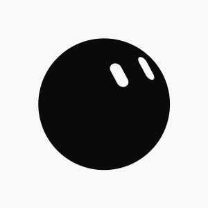
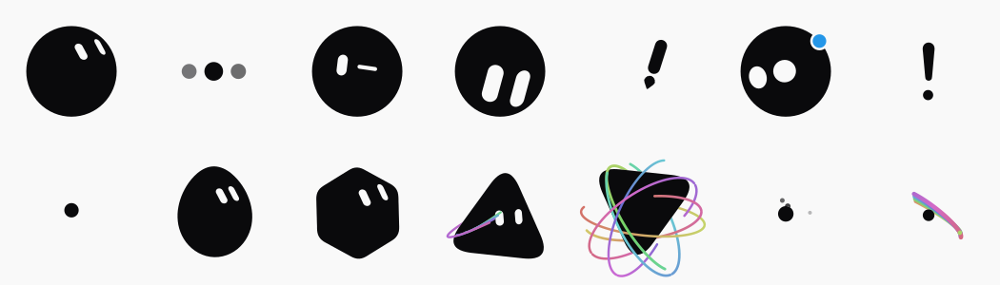

# bloub-for-python

Python port of [bloub](https://github.com/jeremy-prt/bloub) — an SVG recreation
of the x.ai bot avatar. One filled shape morphing through 14 states, two white
shapes for the eyes morphing independently, on a plain background. No animation
library, and (in the core) no framework and no clock: `engine.sample(t)` is a
pure function of time.

This repository ships:

- **`bloub`** — a pure-Python, zero-dependency port of the rendering engine.
  It reproduces the TypeScript original **byte for byte** (path strings and eye
  matrices), verified against golden fixtures in `tests/fixtures/`.
- **A Streamlit app** for customising, previewing and exporting the avatar
  (SVG, PNG, animated SVG, GIF, MP4).





## Install

```bash
# core only (pure stdlib, renders SVG)
pip install .

# with the Streamlit app
pip install ".[app]"

# with PNG / GIF / MP4 export (resvg-py + Pillow + imageio-ffmpeg; cairosvg optional)
pip install ".[export]"

# everything, for development
pip install -e ".[app,export,dev]"
```

## Run the Streamlit app

```bash
streamlit run app/streamlit_app.py
```

The tabs:

- **Customise** — shape (8), colour (12), expression (16) with a live animated
  preview, plus SVG / PNG / animated-SVG / GIF download.
- **States** — the 14 catalogue states side by side.
- **Animations** — a simple montage editor: add / remove blocks, preview as GIF,
  export GIF or MP4.
- **Settings** — language (Français / English / 简体中文 / Türkçe) and credits.

## Use the engine directly

```python
from bloub.engine import BotEngine

engine = BotEngine(scale=100, initial="idle")
frame = engine.sample(0.0)          # BotFrame: bodyPath, eyes, dots, arcs, ...

print(frame.bodyPath)               # an SVG path string
print(frame.eyes[0].matrix)         # the eye transform
```

The engine is a pure function of time: pausing, resuming, jumping to an
arbitrary date and re-reading a past date all give the same image.

```python
from bloub.bot import Bot

bot = Bot(shape="cercle", color="encre", expression="neutre")
svg = bot.svg(t=1.0, size=320)      # a full standalone SVG document
```

## Layout

```
src/bloub/            pure engine (math, shape, face, decor, states, engine, …)
src/bloub/render.py   BotFrame -> SVG
src/bloub/export/     standalone SVG / PNG / animated SVG / GIF / MP4
src/bloub/i18n.py     4 languages (fr / en / zh / tr)
app/streamlit_app.py  the Streamlit UI
tests/                pytest + golden fixtures from the TS repo
tools/                regenerate profiles.py and the eye-offset table
```

See [docs/architecture.md](docs/architecture.md) for the design, and
[AGENTS.md](AGENTS.md) for the invariants to preserve.

## Credits & licence

Original [bloub](https://github.com/jeremy-prt/bloub) by Jérémy Perret
(MIT). This port is MIT — see [LICENSE](LICENSE).
